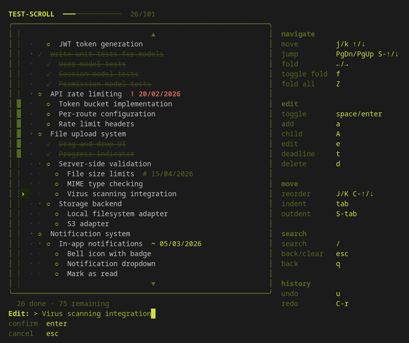

# notch

A TUI todo app. Lists are stored as Markdown files with GFM checkboxes, so they work in any editor.



## Features

- Hierarchical todos with persistent fold state
- Keyboard-driven interface
- Fuzzy search / filter
- Item deadlines with urgency indicators
- Configurable deadline display/input format (always saved as `@YYYY-MM-DD`)
- Undo/redo for item edits
- JSON-based themes
- Lists stored as plain Markdown

## Install

```sh
go install github.com/bitwisepossum/notch@latest
```

See [releases](https://github.com/bitwisepossum/notch/releases) for specific versions or pre-built binaries.

## Usage

```sh
notch
```

### List picker

| Key | Action |
|-----|--------|
| `j` / `k` / `↑` / `↓` | Move cursor |
| `PgDn` / `PgUp` / `Shift+↑/↓` | Jump half page |
| `enter` | Open list |
| `n` | New list |
| `r` | Rename list |
| `d` | Delete list |
| `s` | Settings |
| `q` | Quit |

### Items

| Key | Action |
|-----|--------|
| `j` / `k` / `↑` / `↓` | Move cursor |
| `PgDn` / `PgUp` / `Shift+↑/↓` | Jump half page |
| `←` / `→` | Fold / unfold (contextual) |
| `space` / `enter` | Toggle done |
| `a` | Add item |
| `A` | Add child item |
| `e` | Edit item |
| `t` | Set/clear deadline |
| `d` | Delete item |
| `J` / `K` / `Ctrl+↑/↓` | Reorder item |
| `tab` / `Shift+tab` | Indent / outdent |
| `f` | Toggle fold |
| `Z` | Fold all / unfold all |
| `/` | Search |
| `u` | Undo |
| `Ctrl+r` | Redo |
| `esc` / `q` | Back to list picker (or clear search) |

### Settings

| Key | Action |
|-----|--------|
| `j` / `k` | Move between settings |
| `enter` / `e` | Activate selected setting |
| `c` | Clear save path (revert to default) |
| `←` / `→` / `h` / `l` | Cycle theme / deadline format |
| `R` | Reload themes from disk |
| `esc` / `q` | Back |

## Releases

See [releases](https://github.com/bitwisepossum/notch/releases) for downloads and changelog.

## Storage

Lists are saved as `.md` files in your platform's data directory:

| Platform | Path |
|----------|------|
| Linux    | `~/.local/share/notch/` |
| macOS    | `~/Library/Application Support/notch/` |
| Windows  | `%APPDATA%\notch\` |

The save path can be changed from the Settings screen. The settings file itself (`settings.json`) always stays in the default location above.

Deadlines are stored inline using `@YYYY-MM-DD` at the end of the item line:

```md
- [ ] Submit report @2026-03-10
- [x] Buy groceries @2026-03-04
```

The display format is configurable (e.g. `DD/MM/YYYY`) but the stored format is always `@YYYY-MM-DD`, so files remain portable and editable in any text editor.

## Themes

Themes are `.json` files placed in the `themes/` subfolder of the data directory. On first launch the folder is created automatically. See [`example-themes/`](example-themes/) for included examples and the full field reference.
